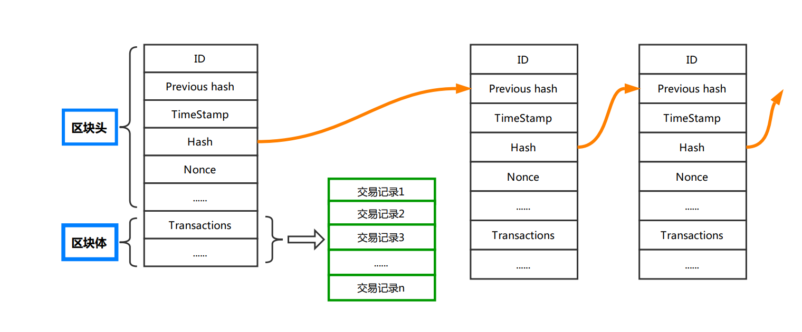

# Polkadot-Handbook

波卡手册：学习、开发、实践

## 什么是区块链

区块链四个核心技术：哈希运算 (SHA256)、数字签名、P2P网络和工作量证明 (PoW)

### 重要文献资料

* [区块链白皮书 比特币：一种点对点电子现金系统](https://bitcoin.org/bitcoin.pdf)

## 以太坊生态

### 重要网址

* [以太坊官网](https://ethereum.org/zh/) 很好的学习开发资料

### 重要文档文献

* [以太坊白皮书-中文](https://github.com/ethereum/wiki/wiki/%5B%E4%B8%AD%E6%96%87%5D-%E4%BB%A5%E5%A4%AA%E5%9D%8A%E7%99%BD%E7%9A%AE%E4%B9%A6)

### Solidity 语言

[Solidity 学习手册](https://solidity-cn.readthedocs.io/zh/develop/index.html)

### Truffle 框架

[Truffle 学习手册](https://truffle.tryblockchain.org/index.html)

## Polkadot 生态

### Polkadot 学习重要参考文章

- [最新版波卡（Polkadot）概述](https://www.polkaworld.org/articles/polkadot-review)
- [Polkadot 中文白皮书](https://www.polkaworld.org/articles/polkadot-white-paper-in-chinese)
- [Parathreads: Pay-as-you-go Parachains](https://polkadot.network/parathreads-parathreads-pay-as-you-go-parachains/)

### Polkadot 重要网址

- [Polkadot 官网](https://polkadot.network/)
- [Polkadot 中文社区](https://www.polkaworld.org/)
- [Polkadot 官方知识库](https://wiki.polkadot.network/)
